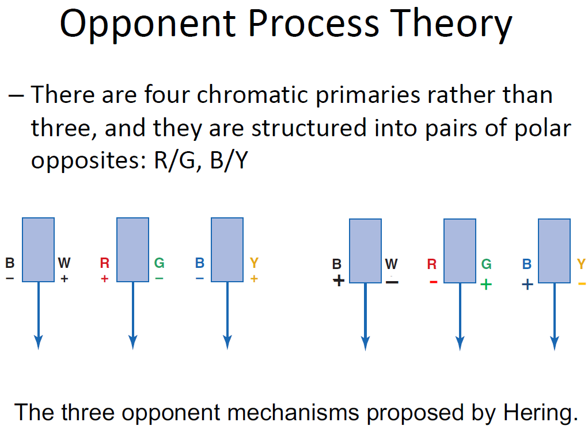
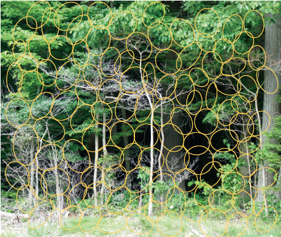
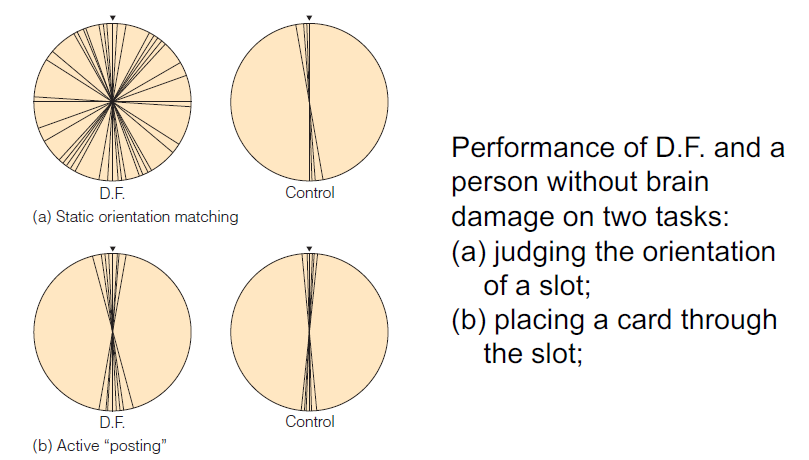
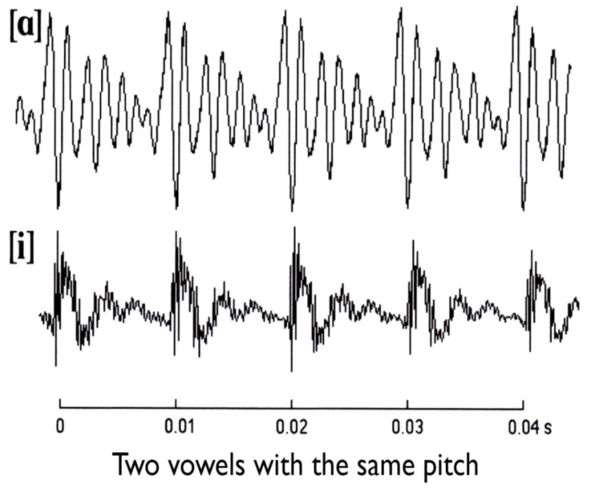
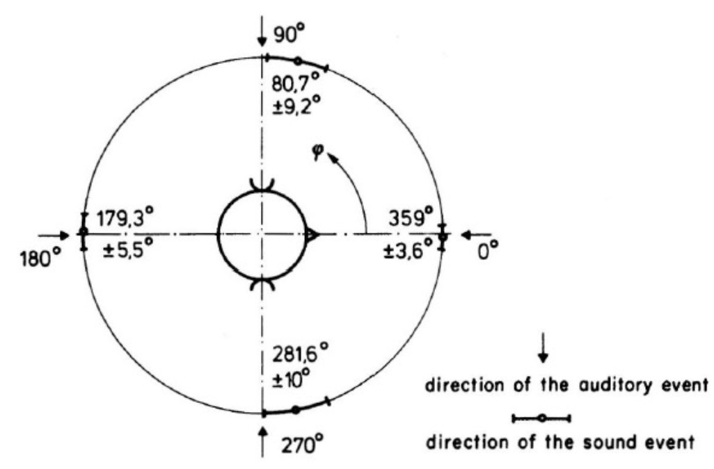
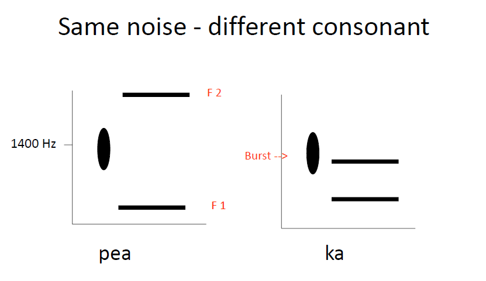

# lecture 2 Image-based Spacial Processing

这节课主要讲retina到V1的部分

## Physiological Mechanism

### human retina

R receptors 光受体细胞-视锥细胞视杆细胞

B bipolar cells 双极细胞

G ganglion cells (神经节细胞)

---

R 光感受子

0$^\circ$ :中央凹 fovea (rich in cone cells)

cone：锥

rods:  柱

盲点blind spot: ~17$^\circ$

---

光感受器之后传到双极细胞（都是模拟量？）

实验上看到了mexican hat的形状，人们propose应该是recurrent的结果。

但是之前的都是模拟量，只有电位的高低……到了神经节细胞才开始产生spike的发放。

---

ganglion cells 产生spikes，进入视神经细胞进入外侧膝状体（核）LGNs再到枕叶的视皮层。

（*他怎么觉得biocular不是很重要……我觉得重要也主要是重建深度之类的*）

---

LGN 也有一样的东西，但是都是monocular的（一直到视皮层都是monocular的）

Each LGN is constructed of six distinct layers of cells.

Magno and Parvo Cells

总之各有操作吧。认为P提供颜色，精细信息；M细胞提供运动等等的信息

### Striate Cortex 纹皮层（V1）

Hubel and Wiesel's discovery

一开始他们还是在照光点，后来发现是moving bar才产生了spikes。

Simple cells：不动的bar也能spike，但是simple cell比较少。

hubel et al. 发现的是complex cells 复杂神经元能占75% ，只对特定moving direction的bar有反应。

hypercomplex cells 超复杂神经元对于bar的terminal是兴奋的

---

Striate Architecture

columnar structure 功能柱。一半R一半L（管的是右侧左侧视觉）

## Psychophysical Mechanisms

行为学操作下的检测

### Spatial Frequency Theory

用一些栅格的东西假装自己是信号（0-1可以分解成正弦的periodical的信号）

总之让你看5分钟5Hz的图，最后performance是表现更差了（啊？）觉得可能是疲劳了，总之人们是按频率看的。

### Physiology of Spatial Frequency Channels

总之频率$\times$contrast最后还是墨西哥帽，也就是gabor filter.

## Computational Approaches

要追溯到MIT Vision Group的 David Marr -- line and edge detector theory

### Marr's Primal Sketches

原始的简图-要素图

连起来短的边……

---

总之要先考虑清楚怎么定义边。我们可以简单的想清楚smoothsurface的光信号应该是gradual的。产生的边可能更abrupt，一般有反射率的不同（材料），光强的不同（阴影）以及表面朝向的不同（角度）。

---

总之marr觉得可以做卷积

实际上也确实很对，sobel滤波器就是这样

marr最后考虑的是过0，Zero-Crossing algorithm的地方就是edge

---

因为marr的sobel 滤波器其实相当于求导，中间是0的就相当于导数上面的峰值，看二阶导就更容易理解了。

某种意义来说marr的二阶的全向的算子很像墨西哥帽的真实的胜利的RF（墨西哥帽）

其实也很像现在的gabor filter（不过是1d的）：

神经上的实现就好像下面这种？

林肯那个图可以说明大尺度的算子提的是低频信号？

---

Witkin's Scale Integration

视觉系统需要决定不同尺度的信息怎么结合？

witkin想到可以把离散的结果变成连续的

### A Theoretical Synthesis

总之有心理物理学的，生理学的，计算的，综合起来我们提出来：

总之LGN做一些事，到V1就开始卷积和不同频率的分析，到后面再进行找边之类的高级的操作（包括纹理啊，双目视觉等等）

## Sensory Code

1.Specificity coding (facial recognizing)

2.Distributed Coding

3.Sparce Coding

早期人们都在争论怎么弄这些编码，比如MLP多层感知机就是distributed 的

---

视觉处理一定要利用图片的结构

state space 状态空间。比如说对于一个矢量$\vec{v}$满足$\mathrm{dim} \vec{v} = n$，然后每个矢量的取值有256给取值，态空间的大小就可以有$256^n$个不同的灰度矢量/矩阵/图片。

自然图像空间首先是state space的一个子空间，然后分布也可能不是随机分布的……

compact coding 紧致编码 <-> Sparce coding 稀疏编码（只有一部分响应）

分布式编码：所有都有响应？

---

人们一开始研究了紧致编码->降维 -- 主因子分析PCA 寻找正交基

其实就是找特征值->特征向量当基

也就是KL变换（？

The set of receptive fields produced by PCA on small patches
(8X8 pixels) of natural images

最后做出来的和墨西哥帽的并不一样。

---

稀疏编码：最大独立成分 ICA

不需要降维之类的去响应，只要一部分就能work。

Many natural image patches (16 X 16 pixels) were presented to a network of 192
recoding units

实际上做出来的就是和墨西哥帽-gabor filter是一样的。

---

## conclusion

# lecture 3 Color Vision

Color is our brain experience to objects, instead of their physical properties.

color vision is really important in multiple tasks including object detection, classification and other fields.

Marr proposed 3 layers: 计算层，算法层，实现层。

## The Computational Description of Color Perception

Newton found that white light is the mixture of colored lights.

visable lights: 380 nm ~ 740 nm

虽然说得很玄学，但是是对的：客观的物理世界和我们的感知世界是不同的。我觉得RGB就是一个很好的例子，混合产生的光和对应波长的光总是产生不一样的物理信号，但是产生了同样的（至少是类似的）人们的视觉感受。

虽然说我们非常感觉亮度明度是一个意思，但物理和心理的关系实际上是一个非线性的映射。

## Basic phenomena

### Additive Color Mixture

the color follows the rule of addition.

maxwell also found that any color in the color triangle could be matched by their combination.

### Subtractive color mixture

发出的光满足加和的性质，但是自然界也存在 黄+蓝 = 绿色 的减法的性质。

原因是所谓三原色是红绿蓝，在白色光照下，蓝色染料是吸收红色，反射蓝色和绿色；黄色染料是吸收蓝色，反射绿色和红色。

两种颜料混合在一起，吸收红色和蓝色，只反射绿色，那么最后看到的是绿色的。

### Color System

Natural color system color space.

three axis：L for luminence, H for Hue, S for saturation.

## Color Theories

Young-Helmholtz : 三基色理论

只要骗过了三种core细胞，人们就感觉是一样的……

但是三基色没办法解释为什么色盲是红绿色盲/黄蓝色盲（因为三个视锥细胞好像没什么关系）

做电生理确实发现了这样的神经元。

这么六种神经元串起来形成了视觉。

---

虽然缺了蓝色，但是人眼觉得没问题——甚至把绿色换成亮度，人们也觉得没问题（？

---

# Lecture 4 Perceiving Surfaces Oriented in Depth

三维重建：how people reconstruct 3-D Space from 2 2D Retina image?

深度和orientation是等价的问题。

## The problem of Depth Perception

无法区分光是在1，2，3点出来的，但是深度信息非常重要，甚至你看电影，照片都能看到深度——这都是幻觉Depth illusory——真实的人类使用的是所谓的“启发式”的东西。

非常重要的Marr曾经提出了2.5-D Sketch，其实就是只看前面的，不看后面的……现在不说这些了。

真实的眼睛能提供很多不同的信息……眼球的状态，双目视差，各种各种……

实际上双目视差可能不是那么重要的信息……

## Oculomotor Information

3对睫状肌通过控制晶状体的焦距控制得到视觉的高频信息。睫状肌的信号也会传入大脑……

当然这是一个很弱的信息，单目-绝对深度。大概1.8-2.4 m之内可能还能用。

---

收敛？

测量双眼中央凹的角度，得到双目的绝对深度信息，几米之内深度都是可以的。

## Stereoscopic Information

1.配准

### binocular disparity

看近处看远处得到的对应点都是不一样的……我们说是crossed disparity。

如果你考虑这个圆，其实是没有时差的……只有出现在前面/后面才会有“视差”。然后计算机视觉考虑的基本是两个的注视点在正无穷，那么整个圆就退化成平面了。

3D电影是偏振的不是颜色的……

---

找对应点怎么着呢？

总之，要么是现有形状的匹配再有匹配；要么是现有匹配再形状分析？

总之对于没有边特征的稀疏点的深度匹配，人可以做到判断深度，但是很慢……暗示人们是先匹配形状再匹配图像。

## dynamic information

双目视差反正也就能管几米，但是动态信息只要你走几步就能在很长的距离上给出一个可以的深度信息。

双目视差是同一时刻给的，运动信息是一个时间序列……

---

#### 运动物体产生的光流

kinetic depth effect

光看投影看不出来，但是如果把扭折的钢丝旋转起来，人们就能够推断出钢丝的形状。

所以说，单目看运动的物体也能得到深度（？

## Pictorial Information

1. 透视投影？
   总是存在vanishing point，平面上的平行线会相交于消失点，并且就在vanishing point上。
2. 和地平线的距离
   和地平线越近的更可能更远。
3. 相对尺寸
   考虑同样的课题的大小基本相等，明显的大小可能表现出远近关系。
4. learnt knowledge-Familiar size
   根据有的很熟悉的东西的大小，就可能推测绝对距离。
5. 大气的信息——高频信号的损失-模糊度可能和距离有非线性的依赖关系……只要我们找到非线性的这样一个关系，就能够至少猜测相对深度
6. 纹理梯度
7. 阴影信息-Lambertian surface

structure from shading--

不过shading 一般我们是觉得光照一般是从上面来的，这是因为我们作为生物只见过从上面来的光……。

包括对人脸的认知也是启发式的，虽然说右面是凹陷的人脸，但是还是会让你感觉到有一个突出的鼻子……

8. edge interpretation
    遮挡的blocking也是一个边的关系

积木块世界……总之这个问题并没有解决好。

边也可以分类成4种。当然我们最关心的是O和D型边，因为他们决定形状。

# Homework 1 using Neural Network to achieve edge detector

Got 5*5 image, output {1,0}

and achieve cornor detector

# Lecture 5 Organizing Object and Scenes

## Perceptual Grouping

How various elements are perceived as going toghther?

synchrony -- 同步性?

common reigion -- 同一区域？

element connectedness -- 单元联通

……

格式塔的描述不能提供足够的定量的理论。

于是：做实验……

做了点之间距离的实验，确实喜欢更近的点作为一个cluster。

---

又做了实验，grouped的图标会影响反应时间长度。要求报告发现有两个相邻的符号是相同的，测量反应时间。

又做了实验，大一点的圈比小一点的椭圆效果更弱；就算画上笑脸也没什么用……？

grouping在接受亮度，深度感知，图形补全……之后。

：Grouping effects occur as late as object recognition？

但是又说知觉组织在各个层级上都存在。

## Region Analysis

格式塔什么没有想区域到底是干什么的。

uniform connectedness -- 均匀联通特性。边 `<->`区域。就是说是不是一个区域内部是具有相同特征的呢？

C, D可以说是单元联通得到的，但是EF还是不能解释。

---

边和区域……

纹理 texture

parsing -- 分解

## figure-ground organization

人们总是会认为前景是在背景前面的，所以才会使劲记住它的边；同时认为背景在背后默默extend……

同时和周围不一样的，对称的，凸的，平行的更容易被认为是前景

这个图就会说，前景背景之后才会做知觉组织。因为要是考虑联通，就要先考虑白的和黑的相连但是和灰的不连，要求先把灰色分出去当背景。

---

看上去好像问题解决了，但是还有一些特殊的问题：有个洞。

如果需要发现是一个洞，一般需要我们看到

1. 洞周围的区域也要有一个外边界
2. 要和外边界之外的背景相同
3. 非偶然联系

---

注意和前景背景：

可以说注意被前景或者图像的哪里拉过去了，但是不会说注意哪里哪里就是前景……

虽然说前景-背景会在中间做，但是如果最后发现在object recognition发现识别的没有意义，那就会再回来影响知觉组织以及前景背景的分割。

context -> figure。

---

## Visual interpolation

Amodel - 非模态

三种理论：

1. figural familiarity theories

有些东西是常见的

2. Figural Simplicity Theories

刻画得“好”，度量用对称性度量？

3. Ecological Constraint Theories -- 环境中更可能出现……

# Lecture 6 Object Perception

## Spatial Organization

object -> retina -> V1 (or Suporior Colliculus)

forming a retinotopic map

since the resolution of fovea is higher, it causes a $\red{Cortical ~ Magnification}$.

当然视拓扑是一个一一映射，但是并不是一个保范的一个映射……不过，在处理的时候，因为强大的neuroplasticity，我们都能适应（并且能适应不一样的！）

### 1.2 the cortex is organized in columns

深度-尺度

横向-preference orientation

用超柱和图片作用，最后得到

## 通路：what where and how

有好事者做了实验，同时损毁一部分动物的脑区来检测到底哪个部分对应什么。他们操作了两个task：

一个是目标探测，体格是地标探测……

统计的结果是这样：

所以我们说，腹侧的这个是what的通路，背侧的是where-空间，位置的通路……

这两个通路实际上能够被追溯到视网膜和外侧膝状体LGN。并且两条通路之间是有交流的。

并且整个视觉的还有相反的通路。-- 自组织……?

### pathways of what and how

这个DF是一个盲人，上面是给一个图片让正常人和DF看，DF就只能瞎猜；下面是给你一个卡让你过去插卡，但是DF就能插对。说是DF的腹侧坏了，但是背侧控制运动的没事。

## Modularity: Structures for faces, places and bodies

对脸最敏感的区域：fusiform face area (FFA), located in the fusiform gyrus

parahippocampal place area (PPA)，关心空间信息，室内室外的。尤其是现在还发现了grid cells网格细胞。

Extrastritate body area (EBA) 由身体和部分身体激活。

当然，不是说就只有这几个在你看对应的东西的时候被激活，激活的东西很多，只是说这几个是特异性地被对应的东西激活。

## Where Vision Meets Memory

当你看到埃菲尔铁塔，悉尼歌剧院，或者什么东西的时候，你的一些neurons被激活……这些neuron不是被图像激活，而是被概念concepts激活。

## connecting Neural Activity and Objection Perception

知觉和响应是一致的……

非常自然的想法是如果我们用mri或者钙成像，能不能重构视觉输入呢？

最早人们做了一个朝向的解码器，后来人们放各种图片然后看大脑活动……但是不是很好弄，因为视觉知觉包含空间信息……

语义解码……

不过到现在效果还是没有那么好。

## Parts

a complex object always could be viewed as being composed of distinct parts.

同一个图像，只是旋转一下，人们就有完全不一样的认识……

Segmentation -- 2 ways： Shape Primitive or Boundary Rules.

Global or Local? which is the first?

总之设计这么一个心理物理学实验……

假设先看全局再看局部，那么global的应该比local的快；第二个是global的对于局部是有影响的……

实验确实看到是这样，而且local对于global的影响很小。

## shape representation

我们怎么考虑形状呢？

最直接的平凡的考虑是用模板：

但是真实物体的形状很复杂……

### Fourier Spectra

傅里叶变换频谱表达。就如同一个傅里叶变换的东西……

### feature and dimension

只考虑特征问题。

### Structural Descriptions

然后这种最后就能画出来一个图来刻画单个字母……

但只能说也是有道理的，但是人好像没有这种功能……？

不能同时看到，但是会交替看到两个不同的状态，而且切换速度越来越快……

考虑一个相空间的问题，我相信这个结果是很好描述的。

just Like orbits in phase space:

## Perceiving Category

important problems:

Novelty & Uniqueness

两个图是等价的，描述了层级的概念分类问题。

（最好的视角——对人来说是45°，对🐎来说也是比较侧面的。

……medial temporal lobe (MTL) 大脑颞叶内侧

---

# Lecture 7 Visual Attention

The observer is actively involved in creating perceptions.

关注+忽略……

客体信息+增强加工（中央凹

## 1. Scanning a Scene

Overt attention 显式注意：中央凹对准

Covert attention 隐式注意：虽然注意，但是不是用中央凹的，用余光关注（非注视点）

## 2.What Direct Our Attention?

involuntary (bottom up - stimuli) + voluntary (top down - goal-driven) process

**conspicuous applies to something that is obvious and unavoidable to the sight or mind.**  **salient applies to something of significance that merits the attention given it** .

### 关注的不仅取决于saliency-Priority map

Scene schemas: an observer's knowledge aboutwhat is contained in typical scenes.

人总是有先验的对于场景的认识……这是和Top-down相关的问题。

比如说厨房里出现一个打印机人们就会注意，司机会注意到路上的路牌……

### Task Demands

在处理一个具体任务的时候也会产生不同的视觉注意……

It isn't surprising that the timing of when people look at specific places is determined by the sequence of actions involved in the task.

just in time strategy: 眼镜的运动就只在我们需要信息前一点发生。

## 3 What Happens When We Attend?

当我们注意什么东西，我们就意识到它……

### Attention Speeds Responding

空间注意：有了注意响应会快

物体的响应：注意力也会增强我们对于物体的响应……？

B，C和A的距离是一样的，因为他们是在同一个物体上。same object advantage

这种就算挡住了，也是知道AB是一个物体上的。

### Attention can influence appearence

存在一个注意过程，在两边的gabor滤波器是除了方向之外都一样的。对一个有注意会有更高的分辨率。

### Attention can shift the location of a Neuron's receptive field？

Attention map：就算固定视点，也会有独立于视拓扑的注意力图。

## what happens when we don't attend?

非注意盲视？

Subjects can be unaware of clearly visible stimuli if they aren’t directing their attention to them.

例子很多……

### change detection -- change blindness

## attention 对于感知场景是必要的吗？

dual-taask procedure

有一个central task，一个peripheral task

……

“the perception of natural scenes does require attention, but some aspects of scene perception may not require attention。"

## 任务无关刺激的效果

Perceptual load

负载理论……

## 特征整合理论 Feature Integration Theory

illusory conjunction：错误的组合？

前注意阶段——视觉字母表

注意阶段：组合各种特征，生成客体知觉？

# Lecture 8 Navigation And Taking Action

导航和动作抓取。

/\**总之他又再说一些具身智能的东西我觉得……**/

总之他还是觉得上面是agi，现在做的SORA和ChatGPT只是trivial的东西……

---

what is the connection between perceiving and moving through the environment?

How people navigate?

how people take actions on objects?

what happen when observing other people's action?

---

Considering a Drone, we have 3 加速度 and angular 加速度。PID控制理论？IMU？

我们要用GPS定位，用各种东西去测加速度角加速度，但是一方面这个噪声很麻烦，一方面又加了各种传感器……

我们能单纯用视觉吗？也许可以，但是其实生物是各种东西，不只是视觉……

## Navigation

二战时期，Gibson研究了飞行员降落的时候感知信息，他发现terrain movement 可以提供降落的信息：the ecological approach to perception.

all movement you are seeing: **optic flow**光流.

光流有两个特征：光流的速度是导数gradient of flow; 目标点光流的消失(absense)被称为the focus of expansion(FOE)

attention的问题是看的点是中央凹，但是光流的说法是看怎么跑。

ecological approach的concept就是the idea of invariant information：information that remains constant even when the observer is moving.

（不过话说回来，光流是怎么算的来着……

### Self Produced Information

当一个人运动的时候，运动就产生信息，信息反过来又指导运动。

### The Senses do not work in Isolation

Gibson觉得感知并不是独立的，视觉听觉触觉嗅觉和味觉不是单独的感觉，而是会为同一个行为提供信息的。

## Navigating Through the Environment

### 你说得对，但是我们真用的是光流吗？

做了心理物理学实验，被试的任务就是给予一个光流刺激，他是否会跑到一个点？被试在0.5~1度都能判断他们是不是再往那个bar跑。

确实是这样，人们也是发现在颞叶内侧上侧区确实存在感受光流的脑区 -- MST。

总之他们发现有的对于平移有响应，有的对于旋转有响应。

### Driving a Car

在执行的时候，FOR是最远地平线的位置，但是人们其实看的是边界；在拐弯的时候，FOE应该是圆心？但是人们看的是路的curve。

理论上如果我们是一个启发式搜索的，我们应该关心FOE，但是实际的视点暗示我们可能是从光流中收集信息。

### Walking

人们走路看个树，也能看出来自己怎么走。

人们还做了实验，给你把眼睛蒙上往前走（之前看了那有一个东西），往前走感觉差不多了就停下。最后都停的很好，所以他们觉得人可能是还是有惯性的感知。

### Way finding

人们怎么寻路呢？一般来说人们会把一些路标当作cue -- landmark - 决策点

发现是海马旁回合这个决策点的记录是有特异性的（看landmark会额外放电）

另一个是给人看虚拟博物馆，转了两圈看决策点和非决策点，最后都变强了，过了一段时间大家都忘了landmark了，再看图片，决策点刺激的activation就强非常多。

---

还有loss of function 的分析，小鼠有的海马旁回坏掉了，结果最后辨别方向的能力就寄了。

地图 -- grid cell 网格细胞（在海马？）

海马-地图，海马旁回的决策点，压后皮质的视角转换……光流可以提供信息……

## Taking Action

**Affordance:可用性（这个词一定要记住……？）**

还是Gibson研究生态的问题

一个椅子，或者什么能坐着的东西，就提供sitting的可用性；一个形状大小正好适合手掌的，就提供了抓握的可用性……

有的受脑损伤的人，已经不知道哪个object对应的词了，但是我们关注的是词汇对应的concept；你跟他说往黑板上写字的东西，他还能反应过来……

### the Physiology of reaching and grasping

背侧通路：where-how

腹侧通路：what

## 观察其他人的行为：运动前区 - 镜像神经元

意大利人在做实验的时候发现猴子不仅是自己抓食物的时候有反应，看到人手抓也能有反应……

而且也不仅是视觉听觉，还能用来预测其他人的intention……不仅仅是看what，而且在看why。不仅是看具体的动作，还可以根据语境来猜测意图。

# Lecture 9 Perceiving Motion

motion also has two cases, just as simple and complicated cases, which is determined by the observer's moving situation.

## Functions of Motion Perception

motion might be the most important perception sensor.

### 客体信息 Information about Objects.

上下其实都有一只鸟，上面的很容易看到，但下面的很麻烦。不过，在下面这个动起来的时候是很容易看到的，这使得它和背景分离开来。

也许有人说上面这个是太模糊了，真实世界不是这样的。但是无可置疑的是相对于object的运动绝对会帮助我们消除歧义（因为从2D重建3D绝对是不可能完全复现的）。

### Motion Attracts Attention

颜色，纹理……都会产生注意，还有一个就是运动也会产生注意的问题。

### Motion Helps us understand events in our environment

外界的运动信息提供what is happening 的信息。而且人们会觉得是人干的坏事？几个三角形，圆圈动了几下，人们还会给他们编故事，并且给它们一些比较像人的特征和性格。

## Motion Percetion

### When do we perceive motion?

真实的物体运动被称为real motion

是错觉的motion被称为illusory motion

最出名的叫做apparent motion似动现象。两个黄灯交错闪烁，然后你就感觉好像是一个黄色方块过来过去。我们看电影，看电视实际上也是这样的原理。

还有一种是诱发运动Induced motion。夜晚上有月亮有云，云比较大，而且比较暗；云比较小而且比较亮。虽然说是云在运动，但是人看起来其实是感觉月亮在运动。

Motion aftereffects 运动后效。在你看一个运动的刺激30-60秒之后就会产生一个station stimulus to appear to move

### Comparing real and apparent motion

心理物理学做了三个实验，同步亮两个灯，真是移动的两个方块和似动，结果是这样的：

蓝色的是大家都共有的区域，红色黄色是真实和似动都有的，而且也很相似。

### What We Want to Explain

我们是想知道我们是怎么搞清楚我们发现什么是运动的东西的。

总之看这个表你就知道是干啥的。

## Motion Perception: Information in the Environment

Gibson: looking for information in the environment.

好吧，gibson的东西没有解释清楚第三个问题，但是有一件好事，就是他尝试从大脑这些去解释问题？不过，我们现在要继续下去了……

## Motion Perception: Retina/ Eye Information

Gibson 的approach是说就在那里：out there

另外一个方式就是说考虑从眼镜到大脑的神经信号的过程。

### The Reichardt Detector

也是50年前提出来的神经的解释，Y末端是兴奋，T末端是抑制。总之Reichardt的探测器的目的是产生一个方向特异性的detector。

能解释第一个问题，但是显然不能解释2，3两个问题。

### Corollary Discharge Theory

所以就提出来了这么一个伴随发放理论。把眼球的运动也考虑进来。

信号来自视网膜和研究旁边的肌肉。三种情况基本就这样三种：

1. 图像偏移信号(IDS)--视网膜有东西就输入
2. 运动信号(MS)：大脑往眼球肌肉有信号就产生，传入眼球肌肉
3. 伴随发放信号(CDS)：伴随着motor signal产生，传回大脑

那么就有人猜测，IDS和CDS中间有一个上传，那么就看到第一个情况只有IDS，第二种情况只有CDS，第三种情况都来了，那就没有。也还挺具身智能的。

---

大概是人们觉得可能有这么一个比较器，但是没有真的存在这么一个神经元？有很多行为上的实验支持这个理论，但我觉得你这个就有点……

总之让猴子看那个点，上面是bar真的在动；下面是bar其实没动；最后有神经元确实是只有上面放电下面不放电。

## Motion Perception and the brain

给猴子看这么个东西，然后下面的是协同性。随着协同性上升，猴子在中颞叶(the middle temporal (MT) area)的神经元判断对方向的能力更好，并且更快，并且发放更多。

### Effect of microstimulation

让猴子看上面这个图，猴子觉得是向右的；我们给猴子向下的MT神经元电刺激，再看这个图，猴子就觉得是向右下方运动。

### Motion from a Single Neuron's point of view

神经元是怎么组织起来形成方向的呢？specific direction。

MT区神经元局部的也就只能看到水平的，上面旗杆顶部当然是斜上方的，但是这个神经元又看不到。

孔洞问题：aperture problem-信息不全

所以说单个神经元不可能分辨方向.

---

想要解决这个问题,生物可能采用了pooling的方法，而且一定要找端点？

## motion and the human body

快速播放两张图片，人们总会看到手是拐弯过去的，不是直接最短路径过去的。

而且motion perception和做动作的脑区是密切联系的。

把光点放在人的关节的位置，关灯之后让人看，人们也能看出来是人在运动。

**biological motion 生物运动**

extrastriate body area (EBA) and fusiform face area (FFA)

总之对于人体和人脸有一些专用的区域来建模……

## Representational Momentum: Motion Responses to Still Pictures

表征动量

一个静止的照片也能让人感觉是在动的。

# Lecture 10 Auditory Representation

计算任务：orient，identify，communication

傅里叶变换？不够

听觉和视觉不同的地方在于波长一方面不一样，并且光是电磁波，声音是机械波

很多都是不连续的，甚至是离散的？

problem：

背景噪声，多声源，环境反射

没有反射：自由场

教室：反射很强……

听觉对于相位不是很敏感……

---

linear v.s. Log scales

频率其实经常聊的是对数分析 实际上分贝也是这么操作的。

生物进化出来的感受都是对数的。

说是听觉损伤了就不能再生了。

外耳道-机械振动(E)--中耳 耳膜，听小骨(M)--耳蜗的液体机械波(I)

两个小窗相位相反……卵窗，圆窗。

具体为什么相位相反的结构原因

耳蜗膜的结构一边窄而韧，另一边宽而柔软。在这里就产生了对于频率的筛选。

指的位置就是振动的膜的位置。

绿的叫外毛细胞，红色那个是内毛细胞，最后推动神经发放

并且内毛细胞只有定向的推动才会有更多的发放。

### 位置编码理论

之前说的是耳蜗推动就会发放，但是实际上更大的声音会推动更多的振动，实际上人不是这么感觉的……

### Phase-locking

觉得神经跟着刺激的相位一起发放，虽然说可以精准定位，但是神经细胞最高400 Hz，跟不上人家……

### Synchrony firing

只要同步就行，不需要完全跟着……

那么，就提出了Volley Theory。

## Volley Theory

有一束神经元，里面是不同的频率，根据所有的神经的合作来判断听到的是什么频率。

---

听觉系统的滤波器最好的分辨是在低频，高频带宽就上升了。

非线性：差频？400+500 ->100 Hz！产生了没有输入的信号。

## 这个是很重要的

作为带通滤波器……在200 Hz反应最大

下面左边的是复合信号，右边是单纯的信号。但是，左边的包络是右边这个的频率信号。

不是说所有的都是这样，是因为给定的sound stimuli是

在真实的听觉过程中，我们的听觉在低频用的是窄带分析，在高频的时候用的是宽带分析。

就是说，低频的频率分辨率比较高，高频的频率分辨率比较低。

不同的各种神经元共同组合，最后形成了一个类似对数图像的结果。

实际上外毛细胞是运动细胞，在很想听的时候推动液体，然后增大响应？

也可以用这个外毛细胞的响应判断小孩有没有聋。外毛细胞还能够减小bandwidth

上面这个是内毛细胞损伤和外毛细胞损伤。

听觉通路是复杂的，之后再说吧……

# Lecture 11 Pitch and Timbre

咽腔是人类独有的，其他的动物没有这种。说是别人都不是直立行走的？但是长颈鹿之类应该也是类似的吧。

anyway这种设置确实帮助人们能发出更多样的声音。

---

声带的开闭次数可以很高，小孩能达到400 Hz。所以正常的摄像机都看不了，但是可以快速的闪动然后短曝光时间做到看到变化……

声源-声道，声道还要考虑鼻腔和口腔。如果想要通过外在的信息反推声带的信息几乎是不可能的……（因为你要解耦合还是什么）

上面是反推是逆向的过程，现在我们用神经网络可以模拟发声+数值优化。

Vocal cords - 声带：振动和驻波

Vocol tract - 声道：

Sound propagation

Physical description……

## Pitch of pure tones

Phase-locking 锁相？

总之人很难听出来5000 Hz以上的音高。

place & timing

## Pitch of complex tones

200 Hz是基频，400 600 800 是倍频。

（Pitch是心理量，频率是物理量）

还有就是可能实际上没有，但是形成了波包，在大脑还会感受到这个频率。

代表一个声音的重复速率？

声门-声带其实声音很低频，后面产生一些比较小的倍频；然后在口腔之类的地方高通滤波，嘴唇可以拉长滤波器？最后就会产生更高频的信号。

声带振动和口腔滤波是异步的，两个都可以变，一个改基频一个改滤波器……

### helmholtz 提出了一些物理的理论……

frequencies corresponding to the difference between two components physical present

总之就是觉得基频加强产生音高信号。

但是这个是有问题的，有人就质疑他的理论……比如说200 Hz的信号和400 + 600 + 800的里面都能听到200 Hz的信号……

Helmholtz就说是Middle-ear distortion 中耳的“差频distortion”，你这一减就减出来200了，所以还是200 Hz的加强。

总之很怪的是这些都是200的Pitch

但是我们做其他的实验，怎么就又变成：

distortion是200，但是实际听到的pitch是210，不是严格的倍频。这说明Helmholtz理论确实不对。

我们之前还介绍了Schouten理论，总之是用波包的理论……

他的理论在高频信号上很有作用，但是Pitch理论主要在低频。

并且左耳给400右耳给600会产生200 Hz pitch。

## Goldstein 理论

1. 在能分辨的谐波(resolved harmonics)
2. 最好匹配的连续的谐波序列 best-fitting consecutive harmonic series

## Computational models of Pitch Perception

### Autocorrelator 颜色线？

总之算各种信号然后算自相关……？

纵轴是自相关系数，横轴是延长信号时间……在$\tau = 0$的时候当然有自相关最大，之后也会出现周期。

其实还是之前说的，然后这个位置下面的基本上就是再加一个从0到往后的一$x e^{-\lambda x}$样子的滤波器……

对一个白噪声做幅度调制

其实和之前说的闹铃产生的Pitch是一样的。

惠更斯之前也发现了这么一个事情。他在某个城堡里面走路，发现喷泉和旁边的楼梯形成了一个声音的反射，他还找到了一个位置，发现刚好形成了乐音……非常有意思。

## Timbre 音色

声道调制之后产生了音色？

严格来说不仅和包络有关系，还和起始和结束有关系。

不同的滤波器产生了不同的结果。

反正正常人说话是左边三个峰，然后这些会唱歌的人可以用声道合成一个峰。

# Lecture 12 Binaural Hearing and Sound Source Localization

……总之在处理声音数据之前，先会经过头和耳朵的滤波……

在自由场中满足：

intensity = power / unit area

$$
I= \frac{P}{A} = \frac{P}{4\pi r^2}
$$

所以距离每增大一倍，声音大小减小6 dB。

---

中低频的声音可以过去，高频的会反射……

对于人类来说，两个耳朵的差异大概可以是：

## Sound source localization

主要是用水平面和中垂面。

水平面的定位还是很强的，正面3°背面5°，侧面分辨率10°。物理上正前方正后方应该是一样的，但是人耳是可以分开的。

中垂面：

定位效果一般，但是理论上单纯两个麦克风是分不开的。

### Azimuth for pure tones 纯音信号的方位角

两个耳朵之间有强度差，称为ILD Interaural Level Difference

不同的方向、不同的频率有不同的ILD的取值，比较大的能到20分贝。

### Interaural Time Difference 时间差

所以神经元怎么操作的呢？

左耳和右耳用延迟线+相关器在脑中就可以算出左右耳差值。

但是还有一些问题，周期2ms的信号，是左边来的还是右边来的？我们知道ITD其实最大是0.6 ms，但是对于超过1500 Hz的高频信号，就成了问题……

2000Hz 落后0.2 ms还是领先0.3 ms？

所以，双耳时间差异只能看小于1500 Hz的信号的位置。

### Azimuth for complex sounds

实际上生活中纯音信号是小的，但是复杂信号更方便操作……

对于高频是带通滤波器，只需要对这个包络进行分析就能够得到时间差和强度差，就能够进行空间定位。

## 听觉定位的计算模型

听觉滤波 -> 半波整流（毛细胞一边有一边没有……？）->低通滤波 -> 发放

z轴是左右耳相关值。

侧抑制……The Lindemann Processor

### 混淆锥

双曲面上的点到左右耳时间的差值是一样的……这导致不能分别前后上下——怎么操作呢？其实是耳廓的作用。

耳朵（甚至和身体）本身不是对称的，作为滤波器本身产生的滤波结果也是不同的。Batteau's theory

人们就想测传递函数 Head-Related Transfer Function

……

在近场1.5 m以内还可以，在更远的地方两耳的强度差可能小于1 dB。

---

头的微小运动也会让前后的差别变得明显，因为会变化左右的时间差。

优先效应/hass 效应

两个声音同时响，就是从中间响的……到后面的，超过一些ms之后就当成回声处理了。。

# Lecture 13 Auditory Perception Organization and Auditory Scene Analysis

耳朵收到的是混合的声音，但是其实人听的时候是听到的单一来源的声音。

## Mechanisms of segregation

听觉就两个机制：bottom up和top down（说了就好像没说）

Successive segregation 连续-分离？

总之是序列的数据，但是有不一样的频率、不一样的空间位置、不一样的音高……

### Successive Grouping by frequency

### Successive grouping by timbre

### Successive groupingby spatial separation

### Attention necessary for build-up of streaming

### Capturing a component from a mixture by frequency proximity

起动？

## Simultaneous Grouping

重要的grouping的线索

连续性/重复  Bergman's ”老+新“

起动时间

调和性 harmonicity

减法-保留相位？

位置线索……

wxh:先grouping再定位。

### 是先grouping还是先分类classify？

其实是先classify，（即使没有grouping也可以！）

### Apparent continuity

听觉里的栅栏效应

bottom-up and top-down are both true。

## Computational Auditory Scene Analysis

听觉场景分析的计算问题……

听觉外周的模型：

# Lecture 14 Speech Perception

Speech is one of the most important thing......

## The Structure of Speech

Pitch 声纹？和 Formant 共振峰

傅里叶变换窄带-宽带？听觉系统低频窄带时间窗长，中高频宽带时间窗短。原因可能是发声信号的三个峰是都在窄带，而辅音信号时间比较短，而且是高频信息

Tone pattern

## why is speech recognition hard?

constants + vowels -> words (CV, CVC)

Prosodic 韵律: pitch contour, stress 重音, durition 时长, palse 停顿, emotion

为什么八哥能够产生类似人的声音？

有一个器官叫鸣管，可以模仿人的声道；灰鹦鹉……？

## Speech is more like semaphore than like music

semaphore 旗语

尤其是中间都有一个“过渡”的阶段

给一个同样的噪声在前面，后面加一个辅音，结合起来听出来的前面的辅音不同……

不同语气之下，目标的target也在变化。

co-articulation：协同发音。

比如说首都的都，一般d的发音是咧开嘴唇的，但是为了后面的u，其实一开始就把嘴撅起来了，实际上人的只要不影响发辅音就行，都是准备好元音的。

## 所以人是怎么操作的？

1 范畴直觉 categorical Perception 往物理连续信号中加入范畴 category ？

Voicing: differences in Voice Onset Time (VOT) 浊音起始时间？

所以说bit 和 pit的差别只是时间上的差别……？

实际上人各种发音也完全有可能有各种重叠，想听懂当然也需要考虑上下文……

把ba-da两个拎出来，一个是下到上，一个是上到下，然后在中间可能50-50的地方就有一个peak。这是一个非线性的问题……

## 不过，是先天的还是后天的？

实际上infant也可以做到。

做的实验是如果一个刺激一直持续，婴儿就会吮吸奶嘴；但是如果出现了一个新的刺激，婴儿就惊了，忘了吮吸……

一样的操作在小老鼠上也有类似的操作，也是利用了惊吓反射（回动一下，可以用电子秤捕捉）

---

行用的是声门；列是发音位置这些……
